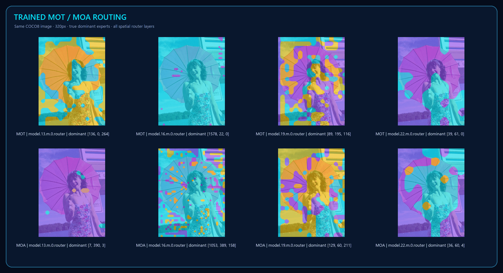
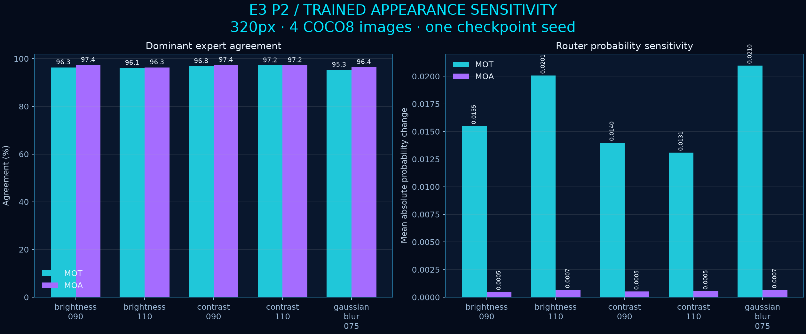
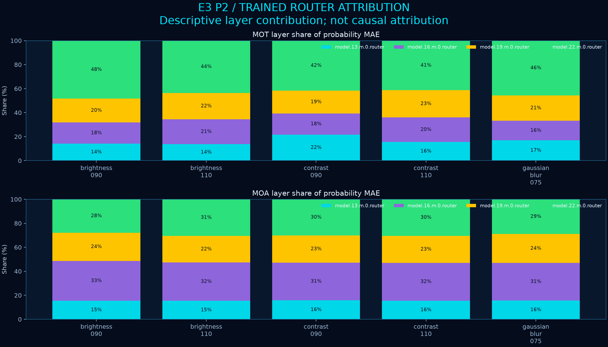
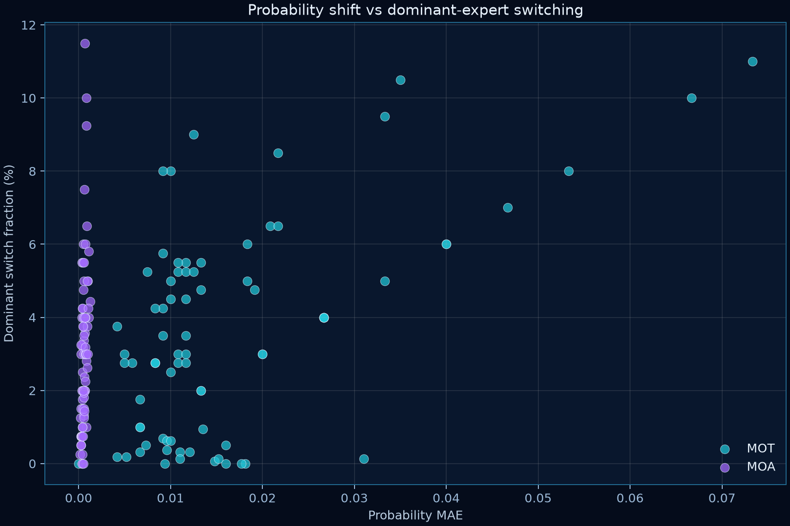
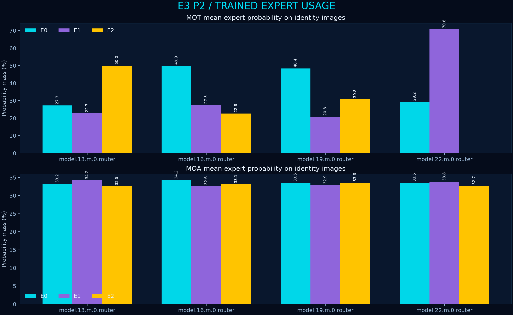
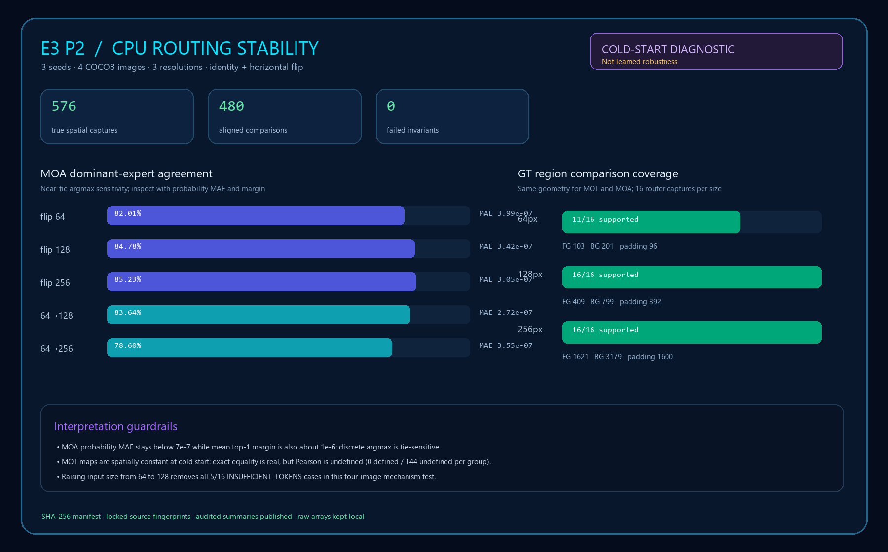
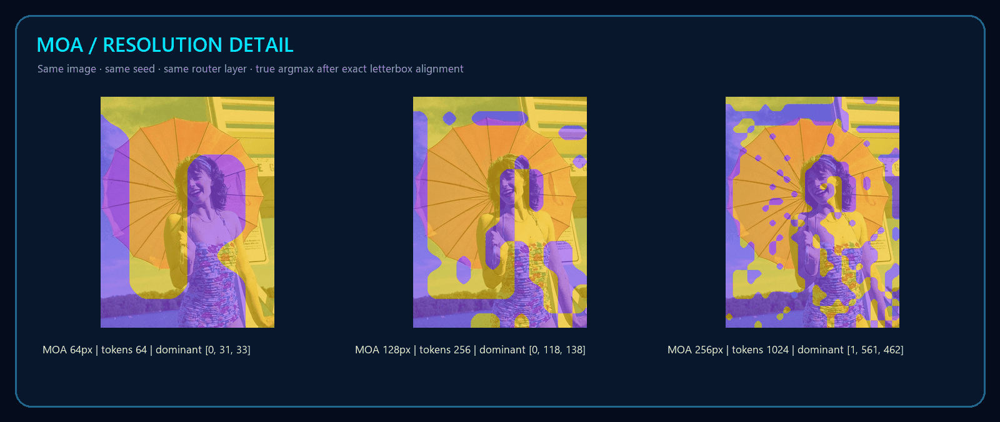
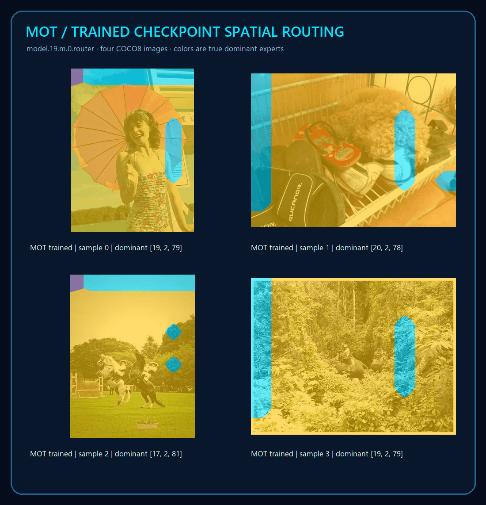

# E3 Routing Lens · P2

腾讯犀牛鸟 E3「五族混合系统的路由透视镜」P2 独立仓库。本版在腾讯 YOLO-Master 的**完整检测模型 forward**上，以可移除 hook 采集真实路由张量；不修改腾讯源码，不再使用旧版 router-only replay。

阶段导航：[Smoke](https://github.com/XavierYChen/e3-routing-smoke) · [P0](https://github.com/XavierYChen/e3-routing-p0) · [P1](https://github.com/XavierYChen/e3-routing-p1) · **P2（本仓库）**


## 训练后 P2 分析（2026-09-09）

新版 P2 直接加载 P1 产生的 10-epoch 预训练迁移 checkpoint，在 4 张 COCO8 原图、320px 输入上采集 MOT/MOA 的全部 4 个空间路由层。五种外观扰动共得到 192 次真实 capture 和 160 组与 identity 对齐的比较。



这次 MOT 不再是 `active experts=1`：前三层的平均概率质量分别约为 `[27.3%,22.7%,50.0%]`、`[49.9%,27.5%,22.6%]`、`[48.4%,20.8%,30.8%]`，图上也能看到三种真实 argmax 颜色；末层仍有一个专家未被 Top-K 选中。MOA 四层的平均概率仍接近三等分，但其空间 argmax 已形成不同区域。颜色只代表每个 token 概率最大的专家编号，并不是聚类类别或物体语义。



| 族 | 最低主导专家一致率 | 最大概率 MAE | 观察 |
|---|---:|---:|---|
| **MOT** | 95.33%（blur 0.75） | 0.02098 | 连续概率变化更明显，但大多数 token 不换专家 |
| **MOA** | 96.34%（brightness 1.1） | 0.000667 | 概率变化小；近并列 token 仍可能换 argmax |



MOT 的 `model.22` 占各扰动层均值 MAE 总和的 41.4%～48.4%；MOA 的 `model.16` 占 31.3%～33.2%。这是“哪一层变化贡献更大”的描述性分解，不是因果归因。





本轮训练 checkpoint 只有 seed 0，因此这些图用于完成工具链和提出下一轮消融假设，不能宣称多 seed 鲁棒性。权重不上传；仓库公开 checkpoint SHA-256、逐项比较、逐 capture 统计、配置和 manifest。

## 新增稳健性与训练后证据



这组数据按 **3 seed × 4 张 COCO8 × 3 分辨率 × 原图/水平翻转 × 2 族 × 4 层**独立运行，共 576 次真实捕获、480 组原图坐标对齐比较，所有 hook、重复性和概率约束均通过。MOA 的翻转主导专家一致率随分辨率从 64 到 256 提高为 `82.01% → 84.78% → 85.23%`；但概率 MAE 仅 `3.99e-7 → 3.05e-7`，而 top-1 margin 也约 `1e-6`，所以应解释为“近并列 argmax 的敏感度有所下降”，不能包装成训练后的鲁棒性。



MOA 没有通过人为阈值或调色制造区域。上图固定 seed、图片、路由层和映射方法，仅把输入从 64 提升至 128/256；token 数从 64 增至 256/1024，因而边界更细。三个专家仍接近均匀，颜色表示真实 argmax，不表示高置信度。



本地已有训练 checkpoint 在 `model.19.m.0.router` 上真实激活 3 个专家，四图合计主导 token 为 `[75, 8, 317]`，邻域概率 L1 均值为 `0.02964`；所以 MOT 可以呈现多色。其余三层仍由单专家主导，且该层 top-1 margin 均值只有 `4.15e-5`。这是一项有 checkpoint SHA-256 的机制证据，不声称已经形成稳定语义专门化。权重文件不上传，公开仓库提供派生图、逐层统计和哈希。

## 验收结论

| 路由族 | 实测输出 | token 热图 | P2 处理 |
|---|---:|:---:|---|
| **MOT** | `[B,3,H,W]`，Top-K=2 | ✅ | 概率、主导专家、熵、margin、原图叠加 |
| **MOA** | `[B,3,H,W]` | ✅ | 概率、主导专家、熵、margin、原图叠加 |
| **MOE** | `[B,2]` | ❌ | 完整模型审计并记录 unsupported |
| **LATENT** | `[B,4]` | ❌ | 完整模型运行态审计并记录 unsupported |
| **MoLoRA** | `[B,4]` | ❌ | 官方三种 router 合约审计并记录 unsupported |

“五族完成”指五族都经过真实接口审计，并不等于五族都有空间 token 轴。给 MOE、LATENT 或 MoLoRA 强行画区域热图会虚构空间信息，因此本仓库明确拒绝。

## 为什么会看到 0 或鲜艳色块

MOT 的 Top-K=2 会把三个专家中未选中的一个概率精确置零，所以 `min probability = 0 (exact)` 是稀疏路由的正确结果。MOA 在随机初始化时接近均匀分配，整体均值约为 `1/3`，Top-1 margin 只有 `3.12e-6`；主导专家图把极小的大小关系画成离散颜色，视觉上很鲜艳，却不能当作已学到专家分工。WebUI 同时给出绝对概率、熵、margin 与前景/背景统计，避免只凭颜色解读。

## 本次证据

| 项目 | 结果 |
|---|---:|
| COCO8 val 图像 | 4/4 |
| 完整模型空间捕获 | 32（MOT 16 + MOA 16） |
| 可切换视图 | 192 |
| 原始数组 | 240（本地生成；GitHub 仅提交脱敏统计） |
| hook 前后 detector 最大差值 | `0` |
| 确定性重复最大差值 | `0` |
| 单图 vs batch=2/4 | PASS，最大差值 `2.98e-8` |
| 源文件 SHA-256 | 9/9 PASS |
| seed | 0（单 seed，功能证据） |

详细表格见 [实验报告](docs/EXPERIMENT_REPORT.md)，五族判定依据见 [可行性审计](docs/FEASIBILITY_AUDIT.md)，字段定义见 [Schema](docs/SCHEMA.md)。

## 打开交互 UI

双击 `run_demo.cmd`，浏览器会打开 `http://127.0.0.1:8766/demo.html`。可以切换 **MOT/MOA、4 张图片、4 个路由层、6 类视图**，也可显示 COCO 标注框并导出当前图。

两分钟现场演示按 [演示与录屏脚本](docs/DEMO.md) 操作。这里采用真实交互页面，而不是把静态图拼成假视频。

## 从零复现

1. 保持 `D:\AI\YOLO-Master`、`D:\AI\datasets\coco8` 与 `D:\AI\envs\yolo_master` 可用。
2. 双击 `run_p2_v2.cmd`。
3. 运行结束后双击 `run_demo.cmd`。
4. 双击 `run_robustness.cmd` 复现 3-seed 稳定性图；已有本地训练权重时，双击 `run_trained_analysis.cmd` 重建训练后外观敏感性、归因、散点图、柱图和路由叠加。

等价命令：

```bat
cd /d D:\AI\E3-Routing-P2
set "PYTHONPATH=D:\AI\E3-Routing-P2\src"
D:\AI\envs\yolo_master\python.exe -m e3_p2 run --config configs\p2_v2.yaml --run-id my-p2-run
```

配置固定 CPU、seed 0、COCO8 val 全部 4 张图、`imgsz=160` 和 batch 等价性检查。结果验证工具链，不声明检测精度提升或已形成专家专门化。

`spatial-routing-raw.npz` 会在本地正式结果目录生成，但不上传 GitHub；仓库提交逐层统计、形状、校验误差和 SHA-256 清单。这样能验收 schema 与数值口径，同时避免公开原始 logits/weights。

稳定性实验的逐捕获数组与 480 条逐项比较同样留在本地；GitHub 提交聚合统计、区域覆盖、约束检查、环境、manifest 和正式图。训练 MOT 补充图依赖本机 checkpoint `D:\AI\tmp\e3-p2-local-checkpoints\mot-coco8-seed0-best.pt`，其 SHA-256 为 `8658764afae0a471e524f7b85f8066c36210c29118c45dac56fe00b8b6591d59`。

## 安全与来源边界

- 只读取白名单内的 YOLO-Master、COCO8 与本仓库路径。
- forward hook 在每次采集后移除；输出等价性为强制检查。
- 日志不记录凭据，不执行任意 shell，不自动上传数据。
- COCO8 图像遵循其原许可；腾讯源码不在本仓库重新分发。
- 参考项目只用于核对验收口径和交互设计，来源见 [NOTICE](NOTICE.md)。
