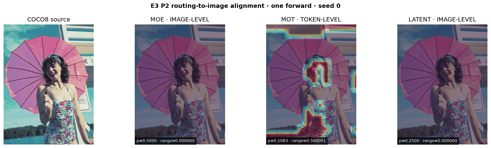

# E3 Routing Observer · P2

腾讯犀牛鸟 E3「五族混合系统的路由透视镜」P2 独立仓库。P2 把真实路由权重投影回 COCO8 原图，提供机器可读空间 schema、静态热图、WebUI 查看器与严格 120 秒演示视频。全部采集通过可移除 forward hook 完成，没有修改腾讯模型的核心 `forward`。

阶段导航：[Smoke](https://github.com/XavierYChen/e3-routing-smoke) · [P0](https://github.com/XavierYChen/e3-routing-p0) · [P1](https://github.com/XavierYChen/e3-routing-p1) · **P2（本仓库）**

## 已完成证据



| 族 | 路由空间语义 | P2 呈现 | 结论 |
|---|---|---|---|
| **MOE** | image-level Top-K | 原图全局叠加、专家图、熵图 | 不是 token 定位 |
| **MOT** | token-level `[B,E,H,W]` | 真正的区域热图、专家图、主导专家图 | P2 核心空间证据 |
| **LATENT** | image-level `[B,E]` | 原图全局叠加、专家图、熵图 | 均匀初始化被如实保留 |

- [打开静态 WebUI](results/verified-p2-cpu-20260907/viewer.html)
- [下载两分钟演示视频](results/verified-p2-cpu-20260907/e3_p2_demo_120s.mp4)
- [查看机器可读记录](results/verified-p2-cpu-20260907/spatial_records.json)
- [查看 schema 与五族缺口](docs/SCHEMA.md)

## 一键复现

Windows 双击 `run_p2.cmd`；默认使用 `D:\AI\envs\yolo_master\python.exe`、本地 COCO8 和 CPU。也可执行：

```bat
cd /d D:\AI\E3-Routing-P2
set "E3_YOLO_MASTER_ROOT=D:\AI\YOLO-Master"
D:\AI\envs\yolo_master\python.exe -m e3_routing_p2.cli --output results\my-run --imgsz 160 --device cpu
```

运行结果已提交到仓库，因此验收查看不要求再次执行。若要替换图片，`--image` 只能指向 `--dataset-root` 白名单内部；结果不会记录绝对路径。

## 实验红线

本仓库记录腾讯 checkout commit/dirty 状态、环境版本、配置路径与 SHA-256。三族使用同一图片、输入尺寸、seed、设备和单次 forward 口径。该结果验证工具功能，不声称精度提升或下降，因此不把单 seed 可视化解释成统计结论。预定义判读线、许可、安全边界和 PR 四节模板见 [验收说明](docs/ACCEPTANCE.md)。

MOT 图使用仓库内 COCO8 训练 10 epochs 的 seed-0 演示 checkpoint，以便呈现训练后空间分化；训练入口为 `scripts/train_mot_demo.py`。它只服务可视化，不作为精度提升证据。

## 下游接口

`e3.spatial_routing.v1` 直接面向 **B1、D1、A3 与新 WebUI**。消费方应首先读取 `spatial_granularity`：只有 `token` 可解释为空间路由；`image` 只表示全图共享权重。

当前交付覆盖 MOE、MOT、LATENT 三族。MOA 与 MoLoRA 的具体缺口和接入条件明确列在 schema 文档中，未用虚构数据凑成五族。

图中 `relative_contrast` 用来显示窄概率区间里的空间结构；原始 absolute probability 图和 min/mean/max/range 同时保留，不能把对比色差当成概率幅度。
