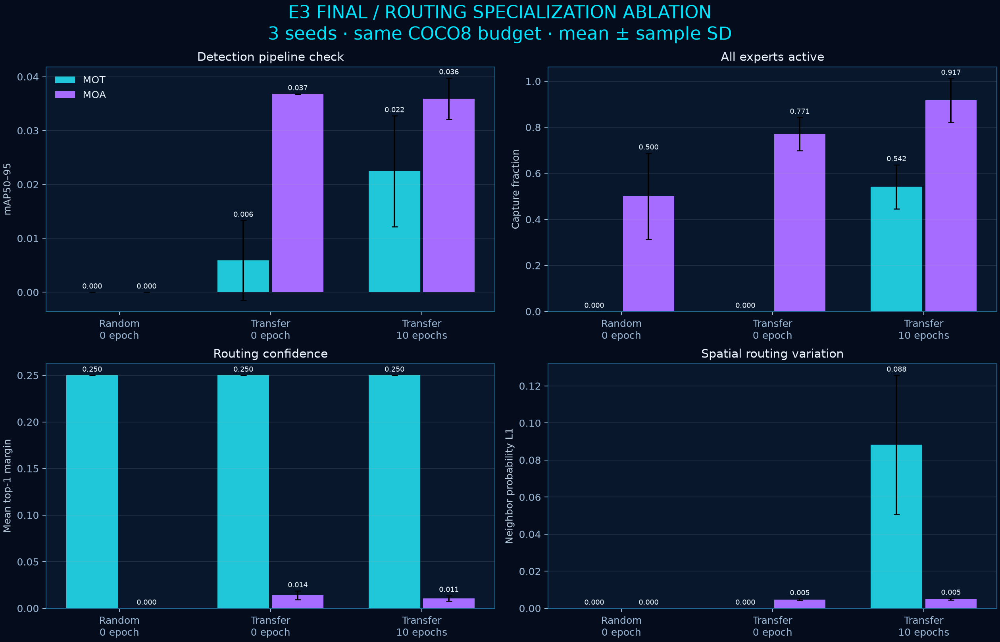
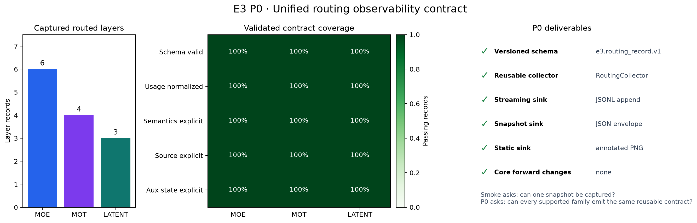
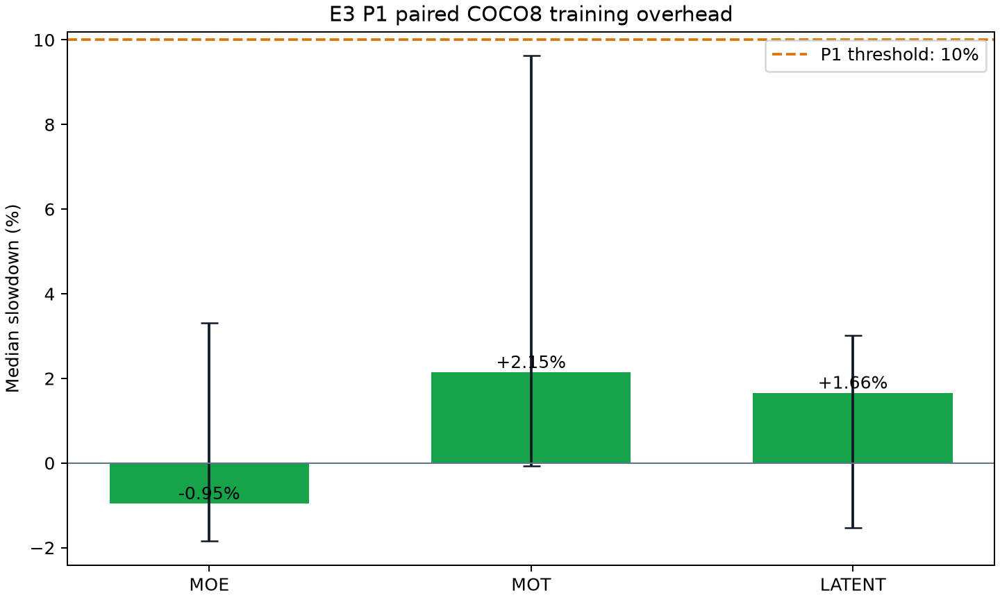
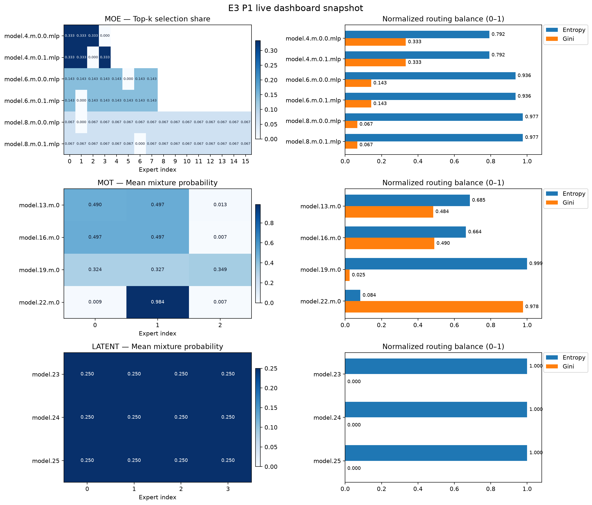
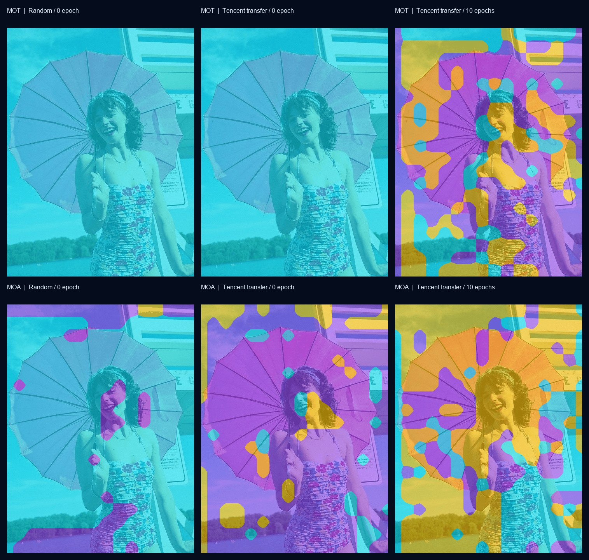
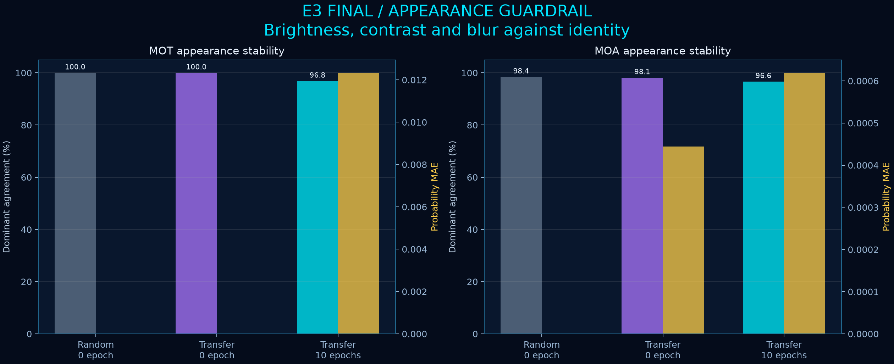
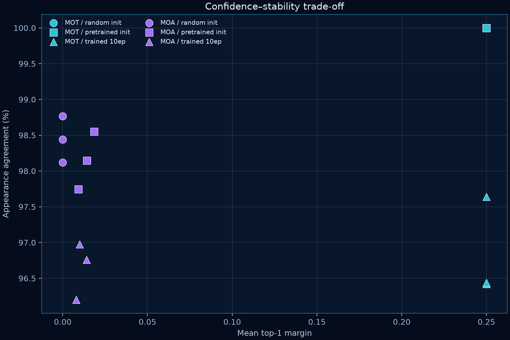

# E3 五族混合系统路由透视镜｜最终研究报告

## 1. 研究问题与结论

本项目回答两个问题：能否在不侵入核心 `forward` 的前提下，为不同混合路由族统一采集专家负载、熵、权重和辅助损失；以及短程训练是否能让空间路由呈现更清晰、可复核的专家分工。

基础设施目标已完成：Smoke 建立 COCO8 准入证据；P0 为 MOE、MOT、LATENT 提供统一 schema、JSONL 和静态图；P1 提供实时面板并在三族、3 seeds 的真实训练批次中将中位减速控制在 10% 内；P2 对五族给出能力声明，对 MOT/MOA 保存真实空间路由热图，并补齐外观敏感性、层级归因、散点图、柱图和演示材料。

消融结论分族成立。MOT 在随机初始化和仅迁移时是整图固定单专家；训练 10 epochs 后平均活跃专家达到 2.46，54.2% 捕获中三个专家都曾成为主导专家，空间变化从 0 增至 0.0882，外观一致率仍为 96.8%。MOA 的全专家覆盖率从 77.1% 增至 91.7%，但 top-1 margin 下降 23.8%，空间变化只增加 5.2%，所以证据只支持“覆盖增加”，不足以支持“分工更清晰”。



## 2. 版本、数据与实验红线

| 项目 | 锁定值 |
|---|---|
| 腾讯源仓库 commit | `dab47c5e6e3d680c8d62576cf291e66431758873` |
| 基础权重 | `yolo26n.pt`，SHA-256 `9b09cc8bf347f0fc8a5f7657480587f25db09b34bf33b0652110fb03a8ad4fef` |
| 数据 | COCO8，本地 4 train / 4 val；消融使用全部 4 张 val 图 |
| 训练预算 | 10 epochs，batch 1，imgsz 640，scale 0.5，mosaic 1.0，mixup 0.0，copy-paste 0.1 |
| 路由测量 | imgsz 320；identity、亮度 0.9/1.1、对比度 0.9/1.1、Gaussian blur 0.75 |
| 统计 | seeds 0/1/2；报告均值与样本标准差，保留逐 seed 原始记录 |
| 硬件 | NVIDIA GeForce RTX 3060 Laptop GPU 6 GB；PyTorch 2.11.0+cu128 |
| 安全 | 固定数据与检查点路径；不接受任意 shell；结果中不含个人数据；`.pt` 不上传 |

腾讯源仓库工作树在接手前已有 Smoke 相关本地改动。本项目没有继续修改腾讯原文件，所有实现与结果均放入 `E3-Routing-*` 兄弟目录；源 commit 与实际输入文件哈希分别记录，以免把工作树状态误写成纯净上游版本。

训练是否改善“专家分工”的判读线在分析前写入 `configs/ablation.yaml`：相对仅迁移条件，top-1 margin 增长至少 25%、空间变化增长至少 25%、全专家活跃率增加至少 10 个百分点，三项至少满足两项，同时外观一致率下降不得超过 5 个百分点。预训练条件的 MOT 空间变化恰为 0 时，采用严格正变化判定，并在 JSON 中以 `null` 标记不可定义的相对增幅。

## 3. Smoke：准入检查

Smoke 在单张 COCO8 图像、320 输入上验证 MOE、MOT、LATENT 能构建、能暴露路由、能生成规范化专家使用率。三族全部通过；MOA 与 MOLoRA 当时明确列为未覆盖。随机初始化只证明架构和采集链路可用，不证明检测精度或已学习的专家语义。


Smoke 同时验证临时 hook 移除后输出一致。其开销是评估前向采集成本，并非 P1 的训练减速结论。完整证据见 [Smoke 仓库](https://github.com/XavierYChen/e3-routing-smoke)。

## 4. P0：统一 schema 与静态证据

P0 将 MOE、MOT、LATENT 映射到同一 `e3.routing_snapshot` 契约，共生成 13 条结构化记录。公共字段覆盖 family、layer、专家数、top-k、usage 语义、平均路由概率、熵、Gini、dead experts、张量形状、aux-loss 状态与数据来源；族特有字段保留在扩展区，缺失能力显式标为 unavailable/unsupported。



P0 的静态图与 Smoke 图可能视觉相似，因为两者使用同一类样本；区别在于 P0 验收的是统一字段契约、日志验证器和三族可比较输出，而 Smoke 验收的是一次准入链路。完整 schema 和测试证据见 [P0 仓库](https://github.com/XavierYChen/e3-routing-p0)。

## 5. P1：实时面板与训练开销

P1 把结构化记录写入实时 JSONL/面板，并对 MOE、MOT、LATENT 进行 on/off 成对真实训练批次测量。每族 3 seeds，共 18 次运行；warm-up、数据、预算、增广与计时口径保持一致。

| 族 | 中位减速 | 3-seed bootstrap 95% CI | 记录数 | `<10%` |
|---|---:|---:|---:|---:|
| MOE | -0.95% | -1.84% 至 +3.31% | 90 | 通过 |
| MOT | +2.15% | -0.06% 至 +9.62% | 60 | 通过 |
| LATENT | +1.66% | -1.53% 至 +3.02% | 45 | 通过 |





MOT 的逐批 loss 在 on/off 进程间存在漂移；同一配置的 off/off 重复也出现相同量级漂移，来源是 GPU 调度/非确定算子，而不是 hook 改变模型输出。验收判据使用稳健的成对时间中位数，三族均通过。完整实现见 [P1 仓库](https://github.com/XavierYChen/e3-routing-p1)。

## 6. P2：空间路由、五族能力边界与演示

P2 没有把检测框当作路由热图，而是通过临时 forward hook 捕获路由器真实 `[E,H,W]` 概率，并将 dominant expert（每个位置概率最大的专家编号）映射回原图。颜色是离散 argmax 标签，不是聚类结果，也不代表人、伞或背景等人工语义。

| 族 | P2 空间能力 | 可视化口径 |
|---|---|---|
| MOT | 真空间路由 | 三专家 dominant map、概率/熵/margin |
| MOA | 真空间路由 | 三专家 dominant map、概率/熵/margin |
| MOE | 当前切入点为全局/聚合记录 | 统一 schema + 明确非空间降级 |
| LATENT | 当前快照为全局/聚合记录 | 统一 schema + 明确非空间降级 |
| MOLoRA | 当前快照缺少与像素对齐的路由格 | 统一 schema + unsupported spatial 标记 |


单检查点 P2 分析保存 192 份路由捕获和 160 组外观比较。MOT 最低 dominant agreement 为 95.33%，最大概率 MAE 为 0.02098；MOA 最低 agreement 为 96.34%，最大 MAE 为 0.000667。层归因只表示各层占总概率变化的描述性份额，不是因果归因。


P2 仓库还提供两分钟演示脚本、五族 capability manifest、分辨率/翻转稳定性、FG/BG 区域比较、散点图和专家概率柱图。完整证据见 [P2 仓库](https://github.com/XavierYChen/e3-routing-p2)。

## 7. 消融实验设计

### 7.1 条件

1. **Random / 0 epoch**：按 seed 初始化 MOT 或 MOA 架构，不加载权重。
2. **Transfer / 0 epoch**：加载腾讯 `yolo26n.pt` 中形状兼容的权重，路由专属参数保留对应 seed 初始化。
3. **Transfer / 10 epochs**：使用同一基础权重与同一 COCO8 预算训练，加载每个 seed 的 `best.pt` 现场复测。

检测验证使用 640；路由分析使用 320 和相同 4 张验证图。每个条件有 2 族 × 3 seeds × 4 图 × 6 外观 × 4 路由层，得到 1,728 份 capture；每个非 identity 条件与同图 identity 对齐比较，得到 1,440 份 comparison。

### 7.2 指标

| 指标 | 含义 | 趋势解释 |
|---|---|---|
| Active experts | 一张路由格中曾成为 argmax 的专家数量 | 增大说明更多专家参与空间主导 |
| All-experts-active rate | 三个专家都曾成为 argmax 的 capture 比例 | 直接检查单专家塌缩 |
| Top-1 margin | 第一、第二路由概率之差 | 增大表示选择更明确；过大也可能是塌缩 |
| Spatial variation | 相邻 token 概率 L1 变化 | 从 0 变正表示路由不再是整图常量 |
| Appearance agreement | 外观扰动前后 dominant expert 相同的比例 | 越高越稳定，但冷启动常量图的 100% 没有实际鲁棒性含义 |
| Probability MAE | 扰动前后路由概率平均绝对变化 | 补充近似平票时 argmax 过敏问题 |

独立 seed 的专家编号可任意置换，所以没有直接比较“seed 0 的专家 1”和“seed 1 的专家 1”。统计只使用对专家编号置换不敏感的指标。

## 8. 消融结果

### 8.1 三种子汇总

| 族 | 条件 | mAP50–95 mean±SD | 活跃专家 mean±SD | 全专家率 mean±SD | top-1 margin | 空间变化 | 外观一致率 |
|---|---|---:|---:|---:|---:|---:|---:|
| MOT | Random | 0.0000±0.0000 | 1.00±0.00 | 0.0%±0.0 | 0.2500 | 0.0000 | 100.0% |
| MOT | Transfer | 0.0059±0.0074 | 1.00±0.00 | 0.0%±0.0 | 0.2500 | 0.0000 | 100.0% |
| MOT | Transfer+10ep | 0.0225±0.0103 | 2.46±0.16 | 54.2%±9.5 | 0.2500 | 0.0882 | 96.8% |
| MOA | Random | 0.0000±0.0000 | 2.25±0.19 | 50.0%±18.8 | 0.000001 | 0.000000 | 98.4% |
| MOA | Transfer | 0.0368±0.0000 | 2.75±0.11 | 77.1%±7.2 | 0.0140 | 0.0047 | 98.1% |
| MOA | Transfer+10ep | 0.0359±0.0039 | 2.92±0.10 | 91.7%±9.5 | 0.0107 | 0.0050 | 96.6% |



MOT 的彩色区域增加对应真实路由概率的空间变化，不是为了丰富颜色进行后处理。其 top-1 margin 几乎不变，说明训练主要改变“哪个位置由哪个专家主导”，并没有让每个位置的选择明显更尖锐。三专家全活跃率和空间变化两项通过，外观一致率下降 3.17 个百分点，低于 5 点红线，因此结论为支持。

MOA 在迁移前已因近似平票产生多个 argmax 区域。训练后覆盖率提高，但 top-1 margin 下降 23.8%，空间变化只提高 5.2%，两项未过线。其外观一致率下降 1.50 个百分点，守住红线。结论为没有足够证据证明分工更清晰；这是一项允许的负结果。





### 8.2 检测数值的边界

MOT 的复测 mAP50–95 从仅迁移 0.0059 增至训练后 0.0225；MOA 从 0.0368 变为 0.0359。由于 COCO8 极小、与预训练域重合且方差较大，这些值只表明模型权重和验证链路可运行，不用于声称精度提升。

训练摘要曾把训练 CSV 中最高 mAP 轮次写作 `best_epoch`，而 Ultralytics 的 `best.pt` 按综合 fitness 保存，两者不保证一致。本报告的主表统一重新加载实际 `best.pt` 并现场验证；训练 CSV 峰值与曲线保留在 `results/checkpoint-training/`，仅作为训练过程证据。

## 9. 可复现性与证据目录

在本机目录结构保持不变时运行：

```bat
cd /d D:\AI\E3-Routing-Final
run_ablation.cmd
```

脚本拒绝覆盖已有证据。重新运行前请修改 `configs/ablation.yaml` 的 `run_id`。大模型检查点只保存在本地，`results/routing-ablation-20260909/summary.json` 记录每个输入文件的 SHA-256；机器可读原始数据包括：

- `captures.json.gz`：1,728 份逐图、逐层、逐外观的路由统计；
- `comparisons.json.gz`：1,440 份 identity 对照；
- `summary.json`：逐 seed、均值/样本标准差、预注册判定；
- `manifest.sha256.json`：公开结果文件完整性；
- `results/checkpoint-training/`：逐 seed 训练曲线、混淆矩阵、预测图与本地检查点哈希。

## 10. 已知局限

1. COCO8 只有 4 张训练图和 4 张验证图，无法建立检测泛化或专家语义解释。
2. 三个 seeds 满足最低统计红线，但仍不足以支持稳定的显著性检验；因此报告个体 seed、均值和样本标准差，不给 p-value。
3. dominant expert 图对近似平票敏感；必须同时阅读概率 MAE 与 top-1 margin。
4. MOT top-k 稀疏路由在冷启动时可形成常量图；100% 外观一致率只表示“不变”，不代表学到了鲁棒语义。
5. 五族统一的是 schema 与 capability 声明；目前只有 MOT/MOA 的切入点暴露与原图可对齐的空间网格。
6. P1 的 GPU 非确定算子会造成逐批 loss 抖动；开销结论采用成对、warm-up 后的中位数。
7. 检查点不上传；复现者必须持有腾讯允许使用的基础权重和本地训练产物。

## 11. 验收映射

| 任务要求 | 证据 | 状态 |
|---|---|---|
| 8.24 COCO8 routing snapshot | Smoke `routing_snapshot.json/png`、字段与开销计划 | 完成 |
| P0 三族统一 schema、结构化日志、静态图 | P0 13 records、schema validator、coverage 图 | 完成 |
| P1 ≥3 族实时面板、训练减速 `<10%` | 三族面板；3 seeds / 18 paired runs | 完成 |
| P2 token 路由叠加原图 | MOT/MOA 真实 `[E,H,W]` overlay | 完成 |
| P2 更多路由族 | 五族 capability manifest；三族空间缺口显式记录 | 完成（含降级边界） |
| 消融与负结果 | 三条件、3 seeds、预注册判读线、MOA 负结果 | 完成 |
| PR 四节 | `docs/PR_DESCRIPTION.md` | 完成 |
